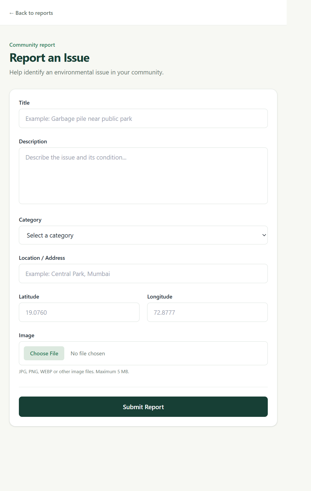
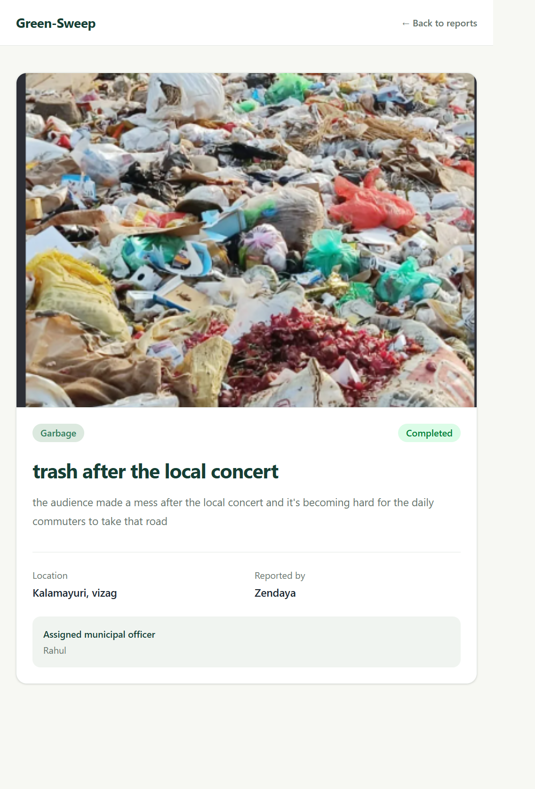
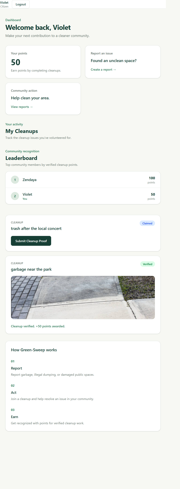
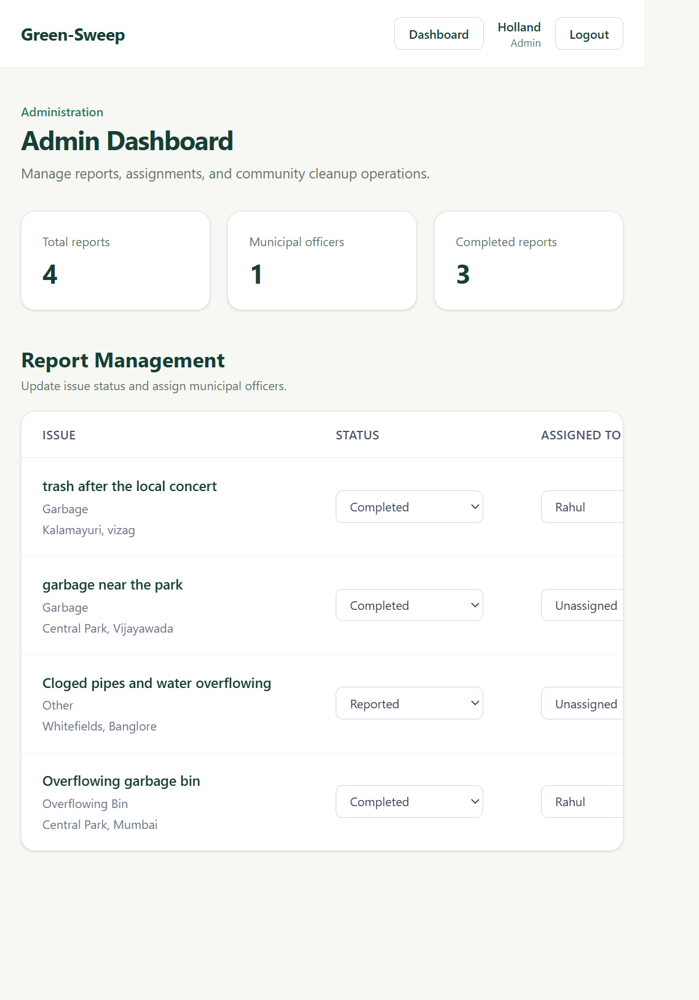
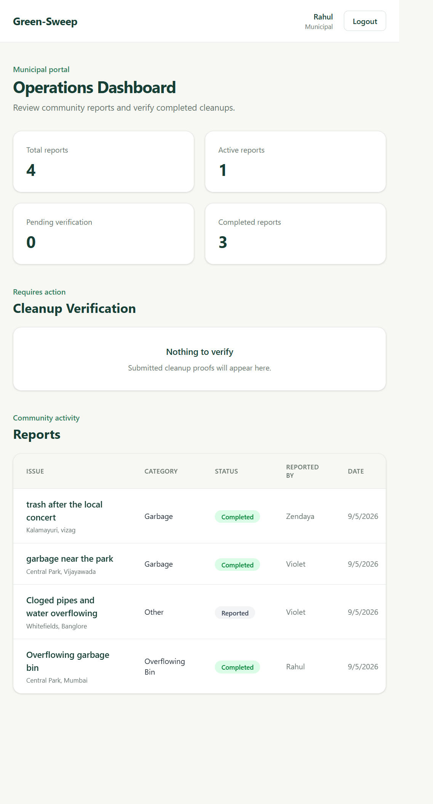

# 🌿 Green-Sweep

**Green-Sweep** is a full-stack community cleanup platform that allows citizens to report environmental issues, participate in cleanups, and earn points for verified contributions.

---

## 📸 Screenshots

<p align="center"><i>1) Report Creation</i></p>
<p align="center">
  
</p>

<p align="center"><i>2) Report Details</i></p>
<p align="center">
  
</p>

<p align="center"><i>3) Citizen Dashboard</i></p>
<p align="center">
  
</p>

<p align="center"><i>4) Admin Dashboard</i></p>
<p align="center">
  
</p>

<p align="center"><i>5) Municipal Dashboard</i></p>
<p align="center">
  
</p>

---

## ✨ Features

- User authentication with JWT
- Role-based access control
- Citizen issue reporting
- Image uploads with Cloudinary
- Municipal report management
- Admin report assignment
- Cleanup claiming and tracking
- Cleanup proof submission
- Municipal cleanup verification
- Automatic points for verified cleanups
- Community leaderboard

## 👥 User Roles

### Citizen
- Register and log in
- Report public-space issues
- Claim cleanup tasks
- Submit cleanup proof
- Earn points for verified cleanups
- View leaderboard

### Municipal Officer
- View assigned reports
- Manage cleanup operations
- Review submitted cleanup proof
- Verify or reject cleanup submissions

### Admin
- View all reports
- Update report status
- Assign reports to municipal officers
- Monitor cleanup operations

## 🧰 Tech Stack

| Layer | Technologies |
|---|---|
| **Frontend** | React, React Router, Tailwind CSS, Axios, Vite |
| **Backend** | Node.js, Express.js, MongoDB, Mongoose, JWT, bcryptjs |
| **Cloud Services** | MongoDB Atlas, Cloudinary |

## 📁 Project Structure

```text
green-sweep/
├── client/
│   └── src/
│       ├── components/
│       ├── context/
│       ├── pages/
│       ├── services/
│       ├── App.jsx
│       └── main.jsx
│
├── server/
│   ├── config/
│   ├── controllers/
│   ├── middleware/
│   ├── models/
│   ├── routes/
│   ├── .env.example
│   └── server.js
│
└── README.md
```

## 🚀 Getting Started

### 1. Clone the repository

```bash
git clone <your-repository-url>
cd green-sweep
```

### 2. Install backend dependencies

```bash
cd server
npm install
```

### 3. Configure environment variables

Create a `.env` file inside `server/` using `.env.example` as a template.

```env
PORT=5000
MONGO_URI=your_mongodb_atlas_connection_string
JWT_SECRET=your_jwt_secret
CLOUDINARY_CLOUD_NAME=your_cloudinary_cloud_name
CLOUDINARY_API_KEY=your_cloudinary_api_key
CLOUDINARY_API_SECRET=your_cloudinary_api_secret
```

### 4. Start the backend

```bash
npm run dev
```

The API runs on:

```text
http://localhost:5000
```

### 5. Install frontend dependencies

Open another terminal:

```bash
cd client
npm install
```

### 6. Start the frontend

```bash
npm run dev
```

The frontend will run on the Vite development server.

## 🔄 Cleanup Workflow

```text
Citizen reports issue
        ↓
Admin reviews report
        ↓
Admin assigns municipal officer
        ↓
Citizen claims cleanup
        ↓
Citizen performs cleanup
        ↓
Citizen submits proof
        ↓
Municipal officer verifies proof
        ↓
Cleanup completed
        ↓
Citizen receives 50 points
```

## 📋 Report Status

- `reported`
- `under_review`
- `assigned`
- `cleanup_in_progress`
- `completed`

## 🧹 Cleanup Status

- `claimed`
- `in_progress`
- `submitted`
- `verified`
- `rejected`

## 🔒 Security

- Passwords are hashed with bcrypt
- JWT authentication protects private API routes
- Role-based middleware restricts administrative operations
- Environment variables are used for secrets
- Uploaded files are restricted to images and limited to 5 MB

## 📄 License

This project was developed as a portfolio project.
